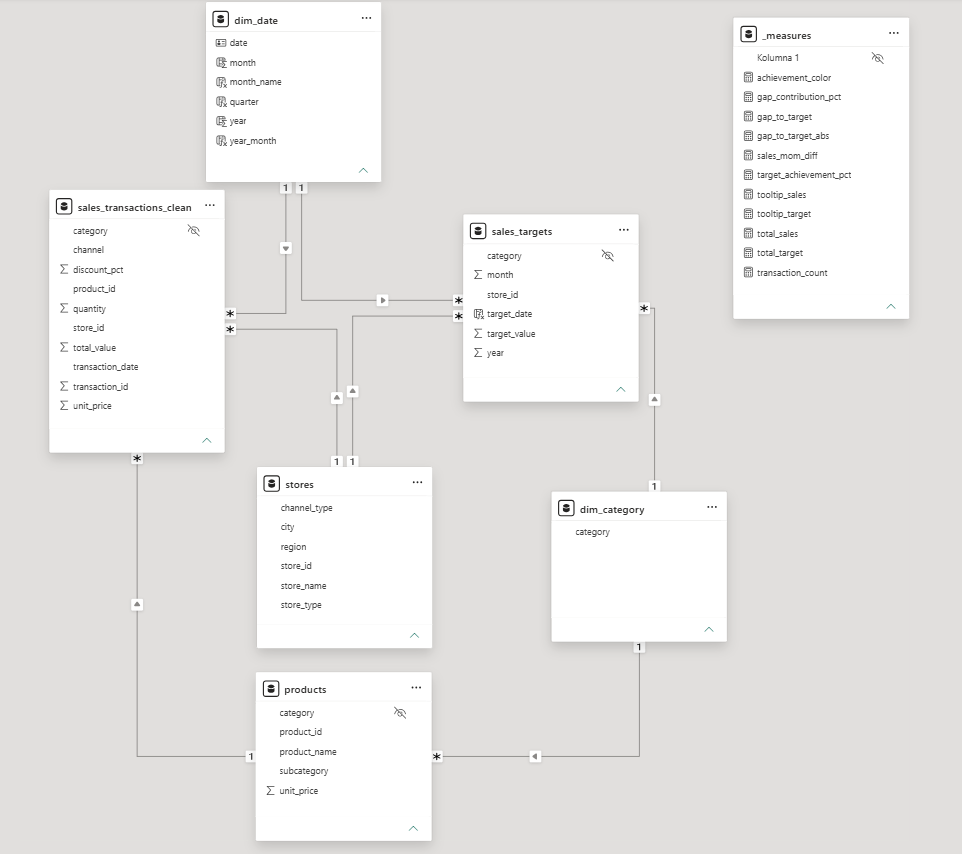
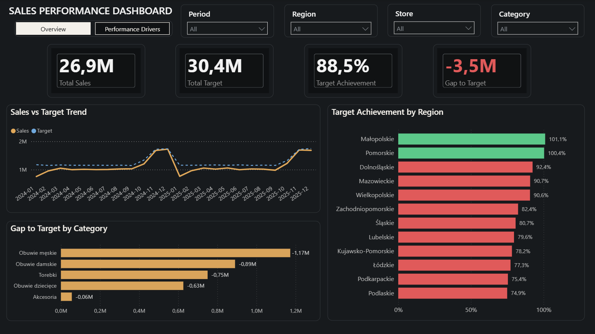
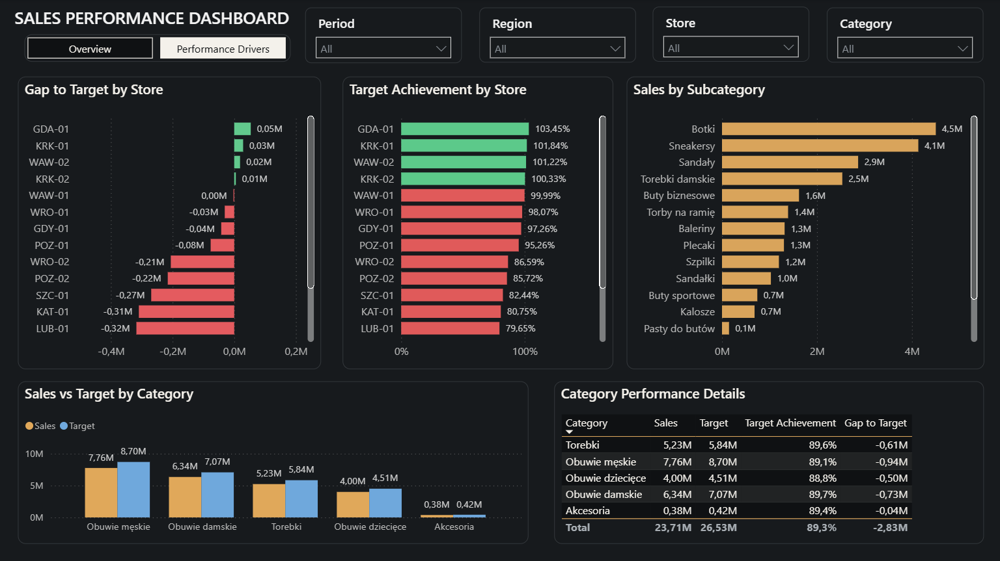

# Sales Performance & Target Analysis

🚧 **Status: In Progress**

This end-to-end analytics project focuses on monitoring sales performance against predefined targets across regions, stores, categories and subcategories.

The project covers the full analytical workflow: from **raw transactional data cleaning and validation in MySQL**, through **data modelling and DAX measure development**, to an interactive **Power BI dashboard** designed to identify performance gaps and investigate the key drivers behind them.

The project uses a custom-built synthetic retail dataset containing intentional data quality issues to demonstrate a realistic data cleaning and analytical workflow.

---

## 📈 Project Workflow

| Phase                                     | Status      |
| ------------------------------------------ | ----------- |
| Data Cleaning & Validation — SQL          | ✅ Complete |
| Data Modelling — Galaxy Schema            | ✅ Complete |
| KPI & DAX Development                     | ✅ Complete |
| Power BI Dashboard — Overview             | ✅ Complete |
| Power BI Dashboard — Performance Drivers  | ✅ Complete |
| Business Analysis                         | ✅ Complete |
| Python Reproduction — Jupyter + SQLAlchemy | 🚧 Planned  |

---

## 🛠️ Project Structure

```text
sales-performance-target-analysis/
│
├── data_cleaning.sql
├── galaxy_schema.png
├── overview.png
├── performance_drivers.png
└── README.md
```

---

## 🧹 Data Cleaning & Validation

The raw transactional dataset contained **141,326 rows** and was cleaned and validated in MySQL before being loaded into the analytical model.

The cleaning workflow included:

* Category normalization
* Full duplicate detection and removal — **1,936 rows**
* Partial duplicate resolution — **153 duplicate pairs**
* Analysis of missing values — approximately **1% per column**
* Standardization of **4 inconsistent date formats** into a single `DATE` type
* Detection and correction of implausible quantity values
* Validation of transformations before creating the final clean table

After the cleaning process, the final dataset contained:

**139,237 clean, analysis-ready rows**

Rather than automatically deleting or imputing problematic records, data quality issues were investigated first. Missing values were analysed before deciding to preserve them, while duplicate resolution and date conversions were validated before creating the final table.

The complete SQL workflow is available in [`data_cleaning.sql`](data_cleaning.sql).

---

## 🗂️ Data Model — Galaxy Schema



The Power BI model follows a **Galaxy Schema (Fact Constellation)** with two fact tables representing related business processes:

* `sales_transactions_clean` — actual sales transactions
* `sales_targets` — predefined sales targets

The model uses shared dimensions to compare actual sales with targets across common analytical levels.

**Main dimensions:**

* `stores`
* `dim_date`
* `products`
* `dim_category`

A dedicated `_measures` table organizes DAX measures separately from the data tables.

This structure supports analysis of **actual sales vs targets** across time, regions, stores and product categories.

---

## 📊 Power BI Dashboard

The report follows an **overview → performance drivers** structure.

The first page answers **what is happening**, while the second page helps investigate **where the performance gap is coming from**.

### Dashboard 1: Overview



The Overview page provides a high-level view of sales performance against targets.

**Key metrics and visuals:**

* Total Sales — **26.9M**
* Total Target — **30.4M**
* Target Achievement — **88.5%**
* Gap to Target — **-3.5M**
* Sales vs Target Trend
* Target Achievement by Region
* Gap to Target by Category

Interactive filters allow the analysis to be narrowed by **period, region, store and category**.

---

### Dashboard 2: Performance Drivers



The Performance Drivers page moves from overall results to a more detailed analysis of the factors contributing to performance.

**Key visuals:**

* Gap to Target by Store
* Target Achievement by Store
* Sales by Subcategory
* Sales vs Target by Category
* Category Performance Details

The page enables users to move from high-level KPI monitoring to identifying specific **stores, categories and subcategories** associated with stronger or weaker performance.

---

## 📐 Key Metrics & DAX

The dashboard uses DAX measures to dynamically evaluate sales performance under different filter contexts.

Key measures include:

* **Total Sales** — total generated sales value
* **Total Target** — total planned sales target
* **Target Achievement %** — percentage of target achieved
* **Gap to Target** — difference between actual sales and target
* **Transaction Count** — number of sales transactions

Additional measures support conditional formatting, tooltips and dashboard presentation.

---

## 💡 Key Business Insights

**Overall Performance**

* Total sales reached **26.9M against a 30.4M target**, resulting in **88.5% target achievement** and an overall gap of approximately **-3.5M**.
* The monthly trend shows that sales and targets move relatively closely over time, but the overall result remains below plan.

**Regional Performance**

* **Małopolskie (101.1%)** and **Pomorskie (100.4%)** exceeded their sales targets.
* Performance varies substantially across regions, with **Podlaskie at 74.9%**, compared with more than 100% in the strongest regions.
* The regional view shows that the overall performance gap is not distributed evenly across the network.

**Store Performance**

* Store-level results reveal substantial differences even within the same overall business environment.
* Among the displayed stores, **GDA-01 reached 103.45%** of target, while several stores remained significantly below plan.
* This makes store-level analysis important for identifying which locations contribute most strongly to the overall target gap.

**Category Performance**

* All major product categories remain below their targets in the overall category comparison.
* **Men's Shoes (Obuwie męskie)** show the largest category-level gap at approximately **-1.17M**, followed by **Women's Shoes (Obuwie damskie)** at approximately **-0.89M**.
* Accessories show the smallest absolute gap, at approximately **-0.06M**.
* The subcategory view allows high-revenue product groups such as **Botki (4.5M)** and **Sneakersy (4.1M)** to be identified within the broader category performance.

---

## 📋 Strategic Recommendations

* Prioritize investigation of the lowest-performing regions and stores to identify the operational or commercial factors behind their target gaps.
* Use regions and stores exceeding 100% of target as internal benchmarks for comparison with weaker locations.
* Focus category-level analysis on **Men's Shoes and Women's Shoes**, which contribute the largest absolute gaps to target.
* Combine category and subcategory analysis to determine whether underperformance is concentrated in specific product groups.
* Continue monitoring Sales vs Target over time to detect widening performance gaps before the end of the reporting period.

---

## 🎯 Key Technical Challenges Solved

### Duplicate Resolution

The raw dataset contained both exact duplicates and more complex partial duplicate records.

Full duplicates were removed directly, while **153 partial duplicate pairs** required additional analysis and consolidation. The result was validated to confirm that the merge did not introduce inconsistencies.

### Mixed Date Formats

Transaction dates appeared in **four different formats**.

The values were standardized into a single SQL `DATE` type and validated before being used in the analytical model.

### Missing Values

Approximately **1% of values per column** were missing.

Instead of automatically removing or imputing these records, their distribution was investigated first. The missing values were preserved after validation rather than introducing unsupported assumptions into the dataset.

### Quantity Outliers

Data profiling identified implausible quantity values.

Affected records were investigated and corrected before the final analytical table was created.

### Visualizing Negative Performance Gaps

Negative `Gap to Target` values created a Power BI visualization challenge because standard bar charts display negative values from zero in the opposite direction.

A helper measure based on the absolute gap was used to control the visual length and direction of the bars, while the original negative values were retained in the data labels.

This preserved the correct business meaning while improving readability.

---

## 📌 Dataset

The project uses a **custom-built synthetic retail dataset** designed to simulate a sales and target-tracking environment.

The transactional data intentionally contains common data quality issues, including:

* Duplicate records
* Partial duplicates
* Missing values
* Inconsistent date formats
* Implausible quantity values

These issues were included to demonstrate a complete **data cleaning, validation and analysis workflow** rather than working with an already-clean dataset.

---

## 🔜 Next Steps

* **Python reproduction:** Reproduce the SQL data cleaning pipeline in a Jupyter Notebook, connecting to MySQL via SQLAlchemy, to demonstrate the same workflow using Python (Pandas) alongside SQL.

---

## 🔧 Tools & Technologies

* **MySQL** — data cleaning, transformation and validation
* **DBeaver** — SQL development and database management
* **Power BI** — data modelling, analysis and dashboard development
* **Power Query** — data preparation
* **DAX** — KPI calculations, conditional formatting and analytical measures
* **Python (Pandas, SQLAlchemy)** — planned, for reproducing the SQL workflow in Jupyter Notebook

---

## 🎯 Skills Demonstrated

* SQL Data Cleaning
* Data Quality Validation
* Data Modelling
* Galaxy Schema / Fact Constellation
* DAX
* KPI Development
* Power BI Dashboard Design
* Data Visualization
* Sales Performance Analysis
* Business Insight Generation

---

*End-to-end portfolio project: SQL → Data Model → DAX → Power BI → Business Insights*
